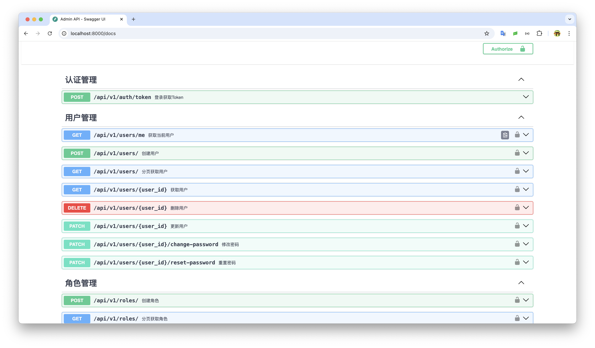
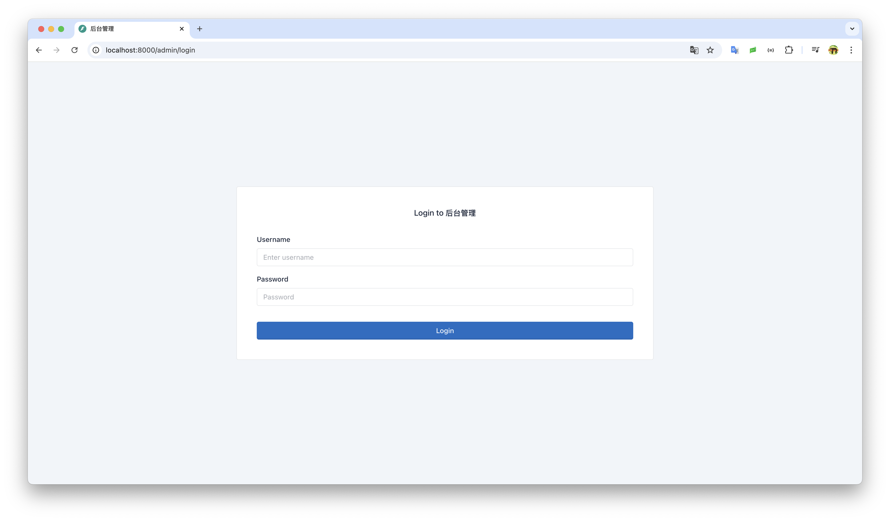
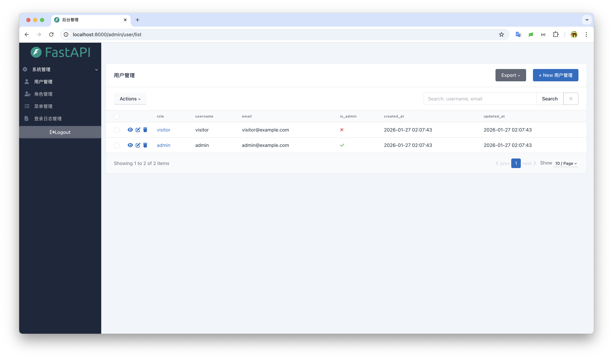
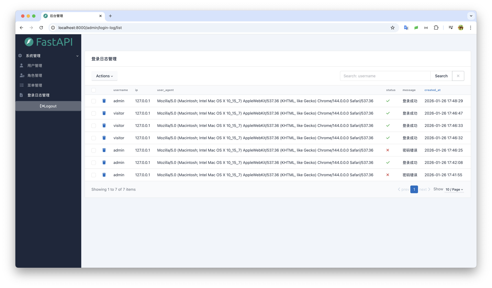

# 后端管理系统模版

## 技术栈
- fastapi
- sqlmodel
- sqladmin
- slowapi
- sqlite
- pyjwt

## 截图






## 目录结构
```bash
tree .
.
├── app                         # 代码根目录
│   ├── __init__.py
│   ├── admin                   # 系统模块
│   │   ├── login                   # 登录日志模块
│   │   │   ├── admin.py            # SQLAdmin模块
│   │   │   ├── api.py              # RestAPI接口
│   │   │   ├── login_crud.py       # 登录日志的CRUD
│   │   │   ├── models.py           # 数据库模型
│   │   │   └── schemas.py          # 限制CRUD读取的格式
│   │   ├── menu                # 菜单模块
│   │   │   ├── admin.py
│   │   │   ├── api.py
│   │   │   ├── data.py             # 初始化菜单数据
│   │   │   ├── menu_crud.py
│   │   │   ├── models.py
│   │   │   └── schemas.py
│   │   ├── role                # 角色模块
│   │   │   ├── admin.py
│   │   │   ├── api.py
│   │   │   ├── data.py             # 初始化角色数据
│   │   │   ├── models.py
│   │   │   ├── role_crud.py
│   │   │   └── schemas.py
│   │   └── user                # 用户模块
│   │       ├── admin.py
│   │       ├── api.py
│   │       ├── data.py             # 初始化用户数据
│   │       ├── models.py
│   │       ├── schemas.py
│   │       └── user_crud.py
│   ├── app.py
│   ├── core                    # 公共模块
│   │   ├── admin.py                # 自定义SQLAdmin的功能
│   │   ├── config.py               # 配置文件
│   │   ├── database.py             # 数据库
│   │   ├── exceptions.py           # 异常处理
│   │   ├── logger.py               # 日志配置
│   │   ├── middlewares.py          # 中间件配置
│   │   ├── openapi.py              # 自定义OPENAPI，主要是为了加权限控制，避免所有人都能访问
│   │   ├── schemas.py              # 公共的Schema定义
│   │   ├── security.py             # RestAPI中的安全定义
│   │   └── slowapi.py              # Rate Limit速率限制
│   └── modules                 # 业务模块，等你来扩展
├── compose.yaml                # 依赖服务，和部署服务
├── db.sqlite3                  # 依赖的sqlite文件，提交到git应该忽略
├── Dockerfile                  # 部署的Dockerfile
├── docs                        # 文档依赖的文件
│   └── images
│       ├── login_log.png
│       └── login.png
├── logs                        # 项目启动后的日志存放
│   └── app.log
├── data                        # 存储sqlite文件
│   └── fastapi.db              # SQLite文件
├── pyproject.toml              # 项目的依赖文件
├── README.md                   # 说明文件
├── requirements.txt            # 生成的pip依赖文件：uv pip freeze > requirements.txt
├── static                      # 项目中依赖的图片、js和样式文件
│   ├── favicon.ico
│   └── logo.png
├── templates                   # Jinja2的HTML文件
│   └── custom.html
└── uv.lock
```

## 部署和启动
```bash
# 克隆代码
$ git clone http://10.0.0.5:4000/fucheng/fastapi-example.git

# 进入到项目目录下
$ cd fastapi-example

# 使用docker compose启动项目
$ docker compose up server -d

# 使用docker启动
$ docker run --rm -it --name fastapi-example -p 8000:8000 -v ./data:/app/data -v ./logs:/app/logs -v ./static:/app/static -v ./templates:/app/templates uhub.service.ucloud.cn/vst_repository/fastapi-example:0.1.0

# 在本地启动
$ uv sync
$ fastapi dev
```

## 链接
- 文档链接：http://localhost:8000/docs
- SQLAdmin链接：http://localhost:8000/admin

> 默认管理员用户：admin/admin123 </br>
> 只读用户：visitor/visitor123 </br>
> 登录做了速率限制，默认每分钟3次，每小时5次错误次数。